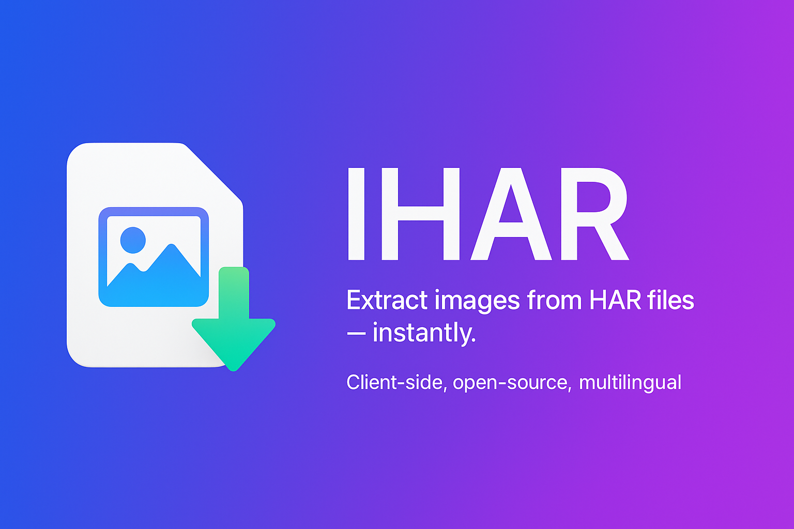
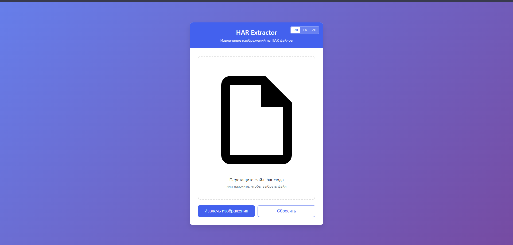

# HAR Image Extractor (Web Version)

**Extract embedded images from `.har` files directly in your browser.**  
Client-side only — nothing is uploaded.

👉 **Live version**: ## 
🌐 Live demo
   

---

## 📌 What It Does

This tool extracts **images only** from `.har` files exported via browser DevTools.  
It detects embedded image responses (`image/*`) and packs them into a `.zip` archive for download.

Supported formats include:

- `.png`
- `.jpg / .jpeg`
- `.webp`
- `.gif`
- `.svg`
- `.bmp`

> 🔒 All processing is local. No servers. No tracking.

---

## 🌐 How to Use (Web Version)

1. Open the [web app]## 🌐 Live demo
   
2. Drag a `.har` file into the drop area *(or click to select one)*
3. Wait for extraction to complete
4. A `.zip` file with all found images will download automatically

> 📎 Note: Only base64-encoded `image/*` entries in HAR will be extracted.

---

## 🖼 Interface

---

## 🛠 Tech Stack

- HTML, CSS, Vanilla JS
- [JSZip](https://stuk.github.io/jszip/)
- [FileSaver.js](https://github.com/eligrey/FileSaver.js)
- Multi-language support: `RU`, `EN`, `ZH`

---

## 📖 License

This project is released under the **GNU GPLv3** license.

You may:
- Use it freely
- Modify the source
- Redistribute under GPLv3 terms

You must:
- Keep the original license and author info
- Publish your source code if redistributing modified versions

---

## 👤 Author

> Developed by Egorin Eugene Alexandrovich  
> Year: 2025  
> GitHub: [@wonderMoronWins](https://github.com/wonderMoronWins)

